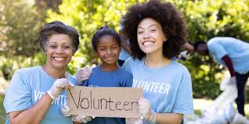

## Project Scope
During the Spring 2024 Semester, the ICS 414 class was structured in a project based format to create a minimum viable product (MVP) for a customer based on the ideas of her organization. I was assigned to a group of 7 where we met bi-weekly delivering milestone progress, conducted code reviews every week, and practiced the Agile development methodology. The class was formatted to simulate industry level software engineering and product development. 

Our customer was hoping to build a "one-stop shop" application for volunteers and organizations. There are current platforms out there right now but they don't seem to be as effective as she's hoping. Being an avid volunteer herself, she felt the pain points in the system in which it was hard for her to keep track of her volunteer hours, what events she had coming up, and just the impact of her efforts. On the other hand as someone who also hosted volunteering events, she felt that organizations also needed a place to post their opportunities and spread more awareness regarding their causes. Given her background, she presented our class with a list of features she wanted to be implemented and assigned priorities to each one. Our team was then able to take this information and started to work on the project. 

## My Experience
The class structure was great. The best part was being able to present the progress to the customer and get feedback as we developed more features. We even started to develop features that weren't on the priority features list initially. Our customer was able to give us feedback on what she liked and what she felt could be improved upon. This is very valuable since I've done projects before but didn't have live feedback on what I should work on. 

Our team was split up into people that were working on the user interface while others worked on the collections such as volunteers, organizations, opportunities, and more. My role this semester was to work on the collections and help out on the front end if needed. The biggest challenge initially was designing a structure for the organizations and volunteers to be connected. I had some initial relational database experience so I was able to give some good insight on how it should be structured. My teammate and I came up with 2 solutions on how what our collections would look like and presented it to our customer. She gave us more clarity on the functionality she was looking for so we decided to have our volunteers and organizations collections separate as opposed to just having one profile that could be either a volunteer or organization. I learned a lot from this experience since I was in active collaboration with another engineer and the customer to come up with the best possible solution. There wasn't really a "right answer". Each option had tradeoffs so we went with what we best saw fit. 

## Moving Forward
The class increased both my technical and soft skills. I was able to improve my code quality from all the code reviews that our team did. This is something I hope to continue to work on in the future as I enter the industry. I also learned what it's like to interact with a customer and build something with a quicker turnaround and more feedback compared to what I had done in the past. Overall this class gave me good project experience that I'll continue to use in the future. 

