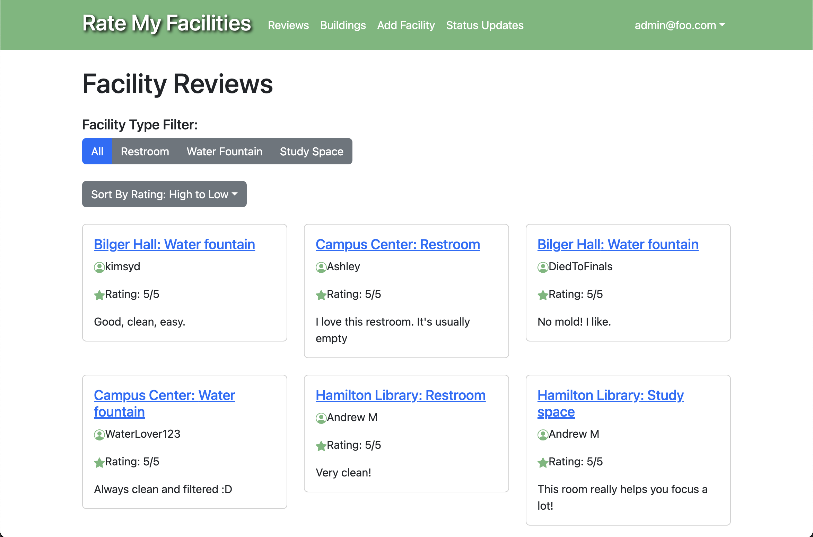

Rate my Facilities is a website for University of Hawai'i students to rate facilities on campus such as restrooms, water fountains, and more. Functionality includes a list of all reviews, a list of all buildings on campus, a form to add a facility and review, as well as status updates. My role in this project was to create the page to list all reviews. I also helped in working out the database schema for all of our collections. From this experience, I learned more about web development and issue driven project management. 

Deployed Application: <a href="https://ratemyfacilities.me/"><i class="large github icon "></i>https://ratemyfacilities.me/</a>

Project Home Page: <a href="https://d-facilitators.github.io/"><i class="large github icon "></i>https://d-facilitators.github.io/</a>

GitHub Repository: <a href="https://github.com/d-facilitators/rate-my-facilities"><i class="large github icon "></i>https://github.com/d-facilitators/rate-my-facilities</a>
